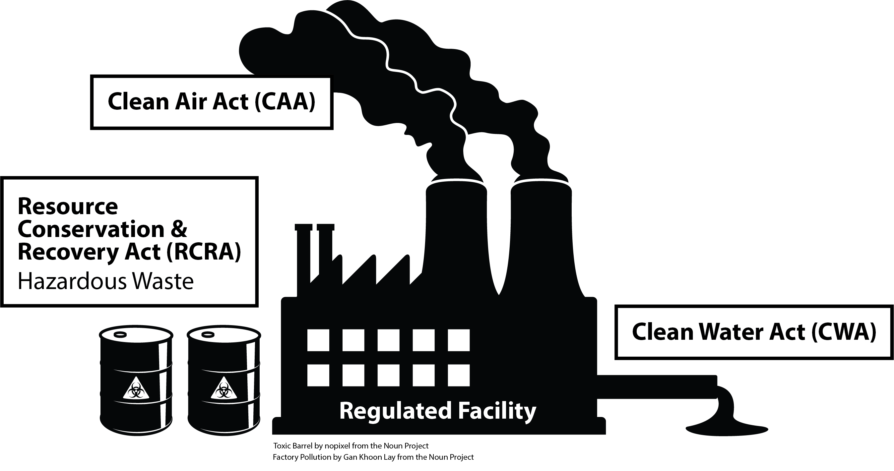
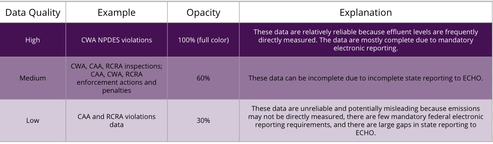

\SetWatermarkText{DRAFT}

```{r setup, include=FALSE}
library(reticulate)
library(RSQLite)
library(rlist)
library(tidyverse)
library(patchwork)
library(here)
library(ggplot2)
library(tidyr)
library(dplyr)
library(shiny)
library(extrafont)
library(viridis)
library(grid)
library(gridExtra)
library(kableExtra)
library(ggrepel)
library(stringr)
library(reshape)
loadfonts()

target_year <- '2021'
state <- params$state
full_name <- params$full_name
output_loc <- paste('Output/',state,"/",sep="")
dir.create(output_loc)

conn <- dbConnect( RSQLite::SQLite(), "leg_info.db")
senators = dbGetQuery( conn, "select * from legislators where cd_state=?",
                         params=c( state ))
dbDisconnect( conn )


knitr::opts_chunk$set(echo = FALSE, message = FALSE, warning = FALSE)
```
```{r echo=FALSE, include=FALSE}
virtualenv_python('edgienv')
u <- import( 'Region' )
region <- u$Region(type='State', state=state, programs=c('CAA', 'CWA', 'RCRA'))
target_year_int <- strtoi( target_year )
violations <- region$get_events( 'violations', 'All', target_year_int )
CAAviolations <- region$get_events( 'violations', 'CAA', target_year_int )
CWAviolations <- region$get_events( 'violations', 'CWA', target_year_int )
RCRAviolations <- region$get_events( 'violations', 'RCRA', target_year_int )
USAinspectionsper1000_All <- region$get_per_1000( 'inspections', 'USA', target_year_int )
inspectionsper1000_state <- region$get_per_1000( 'inspections', 'State', target_year_int )
USAviolationsper1000_All <- region$get_per_1000( 'violations', 'USA', target_year_int )
violationsper1000_state <- region$get_per_1000( 'violations', 'State', target_year_int )
inflation <- region$get_inflation( target_year_int )
CAAenforcement_clean <- region$get_events( 'enforcements', 'CAA', target_year_int )
CWAenforcement_clean <- region$get_events( 'enforcements', 'CWA', target_year_int )
RCRAenforcement_clean <- region$get_events( 'enforcements', 'RCRA', target_year_int )
enforcement <- region$get_events( 'enforcements', 'All', target_year_int )
CWArecurring <- region$get_recurring_violations( 'CWA' )
inspections <- region$get_events( 'inspections', 'All', target_year_int )
CAAinspections <- region$get_events( 'inspections', 'CAA', target_year_int )
CWAinspections <- region$get_events( 'inspections', 'CWA', target_year_int )
RCRAinspections <- region$get_events( 'inspections', 'RCRA', target_year_int )
CAAbadactors <- region$get_non_compliants( 'CAA' )
CWAbadactors <- region$get_non_compliants( 'CWA' )
RCRAbadactors <- region$get_non_compliants( 'RCRA' )

ranked <- round(region$get_ranked())
ranked_t <- data.table::transpose(ranked)
ranked_t["Program"] <- c("CAA", "CAA", "CAA", "CWA", "CWA","CWA","RCRA", "RCRA","RCRA")
ranked_t["Metric"] <- c("Viol/Insp", "Violations", "Viol/Enf", "Viol/Insp", "Violations", "Viol/Enf", "Viol/Insp", "Violations", "Viol/Enf")

```

```{r readData, echo=FALSE}

names(USAinspectionsper1000_All)[1] <- "Program"
names(USAviolationsper1000_All)[1] <- "Program"
names(inflation)[2] <- "base"

#set up a theme default to reduce code block later 
theme_meg <- function () { 
  theme_bw(base_family="Georgia") %+replace% 
    theme(panel.grid.major = element_blank(), panel.grid.minor = element_blank(),panel.border = element_blank(),
          axis.line = element_line(colour = "black"), axis.title.x=element_text(face = "bold", size = 12), 
          axis.title.y=element_text(face = "bold", size = 10, angle=90), plot.title=element_text(face = "bold", size = 14, hjust =.5), 
          axis.text.x=element_text(face = "bold", size = 14), axis.text.y=element_text(face = "bold", size = 8))
}

sen1_name <- senators[1, "name"]
sen2_name <- senators[2, "name"]
sen1_since <- senators[1, "since_date"]
sen2_since <- senators[2, "since_date"]
map_src <- paste('State_maps/',state,'_map.png',sep='')

this_state <- params$state

```

<div class="title"><span style="padding-left: 150px">
 Congressional Report Card
 </span></div>
 <hr style="height:3px;border-width:0; margin-left:15px; margin-right:15px;color: #b9b9b9;background-color: #b9b9b9; margin-top: 0em; margin-bottom: 0em">
##### `r full_name`; seats held by `r sen1_name` since `r sen1_since` and `r sen2_name` since `r sen2_since`
 <div class="container">
  
  <div class="circle-map1">`r region$get_active_facilities('CAA')`</div>
  <div class="circle-map2">`r region$get_active_facilities('CWA')`</div>
  <div class="circle-map3">`r region$get_active_facilities('RCRA')`</div>
  <div class="facility1">facilities</div>
  <div class="facility2">facilities</div>
  <div class="facility3">facilities</div>
  <div class="rectangle">Operating Facilities</div>
  <div class="circle-caa">CAA</div>
  <div class="circle-cwa">CWA</div>
  <div class="circle-rcra">RCRA</div>
  <div class="bottom-left">Map shows `r full_name` with number of regulated facilities per program.</div>
  </div>
<a href="https://www.environmentalenforcementwatch.org/"></a>
<a href="https://envirodatagov.org/"></a>

\pagebreak


<h4>Report Generated on `r format(Sys.time(), '%B %d, %Y')`<span style="padding-left:400px">Page 1</span></h4>

# Introduction 

## Why Report Cards on compliance with and enforcement of Environmental Laws?

The Environmental Protection Agency (EPA) is charged by Congress to enforce laws that protect people from air pollution, water pollution and hazardous waste. **Without effective enforcement, these laws are meaningless**. Based on data from EPA’s Enforcement and Compliance History Online (ECHO) database this report card reviews violations, inspections and enforcement actions under three laws: Clean Air Act (CAA), Clean Water Act (CWA) and Resource Conservation and Recovery Act (RCRA) for this Congressional District or State since 2001. Report cards like this one are becoming available on the [EEW website](https://www.environmentalenforcementwatch.org) for all House Representatives and Senators. The [EEW website](https://www.environmentalenforcementwatch.org) also has a summary analysis of enforcement trends and data issues for all geographies covered by the House Energy and Commerce and Senate Environment and Public Works Committees. The report cards contain data from *both* state environmental agencies and the EPA. If the  states are enforcing the above laws, it is because the EPA has delegated that authority to them. The EPA must ensure that states are doing their job. Congress must ensure that the EPA is adequately funded and is doing its job. And the public must have accurate data from states and the EPA in order to understand if national environmental laws are being properly enforced. EEW Congressional Report Cards give members of Congress and their constituents the chance to evaluate whether the EPA is fulfilling its mandate in their district. Congress can strengthen EPA enforcement by increasing its budget, passing more effective laws, requiring better data collection, and holding the EPA accountable when it fails to protect people.


## What is a "regulated facility"?

<a ></a>

<br />

A regulated facility in this report is a facility that reports air or water emissions under the Clean Air Act or Clean Water Act, or a facility that generates, transports, or disposes of hazardous waste under the Resource Conservation and Recovery Act. Regulated facilities can be large-scale e.g. oil refineries, or small-scale e.g. dry cleaners.

\pagebreak

<hr style="height:3px;border-width:0;margin-left:15px; margin-right:15px;color: #C1E0D7;background-color: #C1E0D7; margin-top: 0em; margin-bottom: 0em">
<h4>Report Generated on `r format(Sys.time(), '%B %d, %Y')`<span style="padding-left:400px">Page 2</span></h4>

# Grading the District on Data from `r target_year_int-4` through `r target_year`


<h3>This graph shows how this district compares by its percentile with other U.S. congressional districts on three metrics: number of violations, number of violations per inspection, and number of violations per enforcement action. These metrics are used on the data from each of  three EPA programs--the Clean Water Act (CWA), the Clean Air Act (CAA) and the Resource Conservation and Recovery Act (RCRA). The data used is for the past five years, `r strtoi(target_year)-4` through `r target_year`.</h3>

<br />

```{r, fig.height = 5, fig.width = 8, fig.align = "center"}

grade <- function(score) {
  return (case_when(score >= 40 ~ 'F',
                   score >= 30 ~ 'D',
                   score >= 20 ~ 'C',
                   score >= 10 ~ 'B',
                   TRUE ~ 'A'))
}

metric_colors <- c("darkblue", "#008080", "orange")
# ranked_t$order <- c("b","a","c","e","d","f","h","g","i")
ranked_t$order <- c("b","a","c","b","a","c","b","a","c")

state_rank_bar <- ggplot(ranked_t, aes(fill=order, y=V1, x=Program, alpha=Program))+
  geom_bar(position="dodge", stat="identity")+
  scale_fill_manual(values=metric_colors, labels = c("Violations/Facility","Violations/Inspections","Violations/Enforcements"))+
  labs(y="Percentiles Among Districts\n", x="")+scale_alpha_manual(values=c(1,1,1), guide='none')+
  geom_text(aes(label=V1, family="Georgia"), position = position_dodge(0.9), vjust = -0.1, size=5)+
  ggtitle(paste("Ranking Among All States, 2017-2021"))+
  scale_y_continuous(expand=c(0,0),limits=c(0,50))+
  theme_meg()
  
```
```{r echo=FALSE, fig.height=3, out.width= "95%", out.extra='style="float:center; padding:0px"'}
state_rank_bar
```

<h3>As an example, a Violations ranking of `r ranked$CWA_Viol_Rank` for CWA means that this state has more violations per facility than `r ranked$CWA_Viol_Rank` of all states in the United States. From these rankings we can assign letter grades to states--the top 10, those states with more violations than 80% of all states, would get an F; the states scoring between 30 and 40 get a D; between 20 and 30 get a C; between 10 and 20 get a B; and the 10 with least violations per facility get an A. With that grading scheme, `r params$full_name` is given the following grades:</h3>

<ul>
  <li><h3>CAA Violations per Facility - `r grade(ranked$CAA_Viol_Rank)`</h3></li>
  <li><h3>CAA Violations per Inspection - `r grade(ranked$CAA_Insp_Rank)`</h3></li>
  <li><h3>CAA Violations per Enforcement - `r grade(ranked$CAA_Enf_Rank)`</h3></li>
  <li><h3>CWA Violations per Facility - `r grade(ranked$CWA_Viol_Rank)`</h3></li>
  <li><h3>CWA Violations per Inspection - `r grade(ranked$CWA_Insp_Rank)`</h3></li>
  <li><h3>CWA Violations per Enforcement - `r grade(ranked$CWA_Enf_Rank)`</h3></li>
  <li><h3>RCRA Violations per Facility - `r grade(ranked$RCRA_Viol_Rank)`</h3></li>
  <li><h3>RCRA Violations per Inspection - `r grade(ranked$RCRA_Insp_Rank)`</h3></li>
  <li><h3>RCRA Violations per Enforcement - `r grade(ranked$RCRA_Enf_Rank)`</h3></li>
</ul>

<h3>Rationale for grading using these metrics:</h3>
<ul>
  <li>More <strong>violations per active facility</strong> are worse.</li>
  <li>More <strong>inspections</strong> mean more problems will be found, which is good. Dividing violations by inspections indicates the strength of the inspecting</li>
  <li>More <strong>enforcements</strong> when violations are found disincentivizes violating. Dividing violations by enforcements indicates the willingness to call fouls.</li>
</ul>

*see data limitations page for metric calculations


\pagebreak

```{python echo=FALSE}
import warnings
warnings.filterwarnings("ignore")

from create_df import create_df

cwa_insp_years = create_df(region_type='State',data_type='inspections',
               y_field='Count',program='CWA',states=[r.this_state,])
cwa_viol_years = create_df(region_type='State',data_type='violations',
               y_field='Count',program='CWA',states=[r.this_state,])
cwa_enf_count_years = create_df(region_type='State',data_type='enforcements',
               y_field='Count',program='CWA',states=[r.this_state,])
cwa_enf_count_years = cwa_enf_count_years.drop('Amount',1)
cwa_enf_dollar_years = create_df(region_type='State',data_type='enforcements',
               y_field='Amount',program='CWA',states=[r.this_state,])
cwa_enf_dollar_years = cwa_enf_dollar_years.drop('Count',1)
cwa_enf_dollar_years['USA'] = cwa_enf_dollar_years['USA']/1000.
cwa_enf_dollar_years[r.this_state] = cwa_enf_dollar_years[r.this_state]/1000.

```

```{r echo=FALSE, include=FALSE}
cwa_insp_years <- reshape::melt(py$cwa_insp_years, id=c("Year"))
cwa_viol_years <- reshape::melt(py$cwa_viol_years, id=c("Year"))
cwa_enf_count_years <- reshape::melt(py$cwa_enf_count_years, id=c("Year"))
cwa_enf_dollar_years <- reshape::melt(py$cwa_enf_dollar_years, id=c("Year"))
```

```{r echo=FALSE, include=FALSE}
# Color selection
region_colors <- c("darkblue", "#008080", "orange", "#46B8DA")

graph1 <- ggplot(cwa_insp_years, aes(x = Year, y = value, color = variable)) +
  geom_line() +
  scale_color_manual(values = region_colors) +
  guides(color = guide_legend(title = "Regions")) + 
  labs(y="# Inspections", x="Year", title="CWA - Inspections Per Facility")
graph2 <- ggplot(cwa_viol_years, aes(x = Year, y = value, color = variable)) +
  geom_line() +
  scale_color_manual(values = region_colors) +
  guides(color = guide_legend(title = "Regions")) + 
  labs(y="# Violations", x="Year", title="CWA - Violations Per Facility")
graph3 <- ggplot(cwa_enf_count_years, aes(x = Year, y = value, color = variable)) +
  geom_line() +
  scale_color_manual(values = region_colors) +
  guides(color = guide_legend(title = "Regions")) + 
  labs(y="# Enforcements", x="Year", title="CWA - Enforcement Actions Per Facility")
graph4 <- ggplot(cwa_enf_dollar_years, aes(x = Year, y = value, color = variable)) +
  geom_line() +
  scale_color_manual(values = region_colors) +
  guides(color = guide_legend(title = "Regions")) + 
  labs(y="Fines ($1000)", x="Year", title="CWA - Enforcement Fines Per Facility")

```
```{r echo=FALSE}
which_president <- function(which_year) {
  case_when(
      which_year < 2009 ~ "Bush",
      which_year < 2017 & which_year > 2008 ~ "Obama",
      which_year < 2021 & which_year > 2016 ~ "Trump",
      which_year > 2020 ~ "Biden"
    )
}

##getting %difference CWA violations
CWAviolations <- CWAviolations %>%
  mutate(President = which_president(Year))

vCWAchange <- data.frame("BushObamaAverage" =mean(CWAviolations[1:16,2]),
                             "Trump Average" =mean(CWAviolations[17:20,2])) # SH

vCWAchange$PercentDifference <- as.numeric(100*(vCWAchange[1,2]-vCWAchange[1,1])/
                                                 vCWAchange[1,1])
vCWAchange$PercentDifference <-round(vCWAchange$PercentDifference,0)

vCWAchange$Extra <- ifelse((vCWAchange$PercentDifference>=100)|(vCWAchange$PercentDifference<=-100), "much", "")
vCWAchange$Change <- ifelse(vCWAchange$PercentDifference<0, "better", "worse")

vCWAchange$Positive <- abs(vCWAchange$PercentDifference)
vCWAchange$Value <- ifelse(vCWAchange$PercentDifference>=0, "increase", "decrease")

#enforcement % difference
enforcement$Amount <- round(enforcement$Amount,2)
#add presidental years
enforcement <- enforcement %>%
  mutate(President = which_president(Year))

actionchange <- data.frame("BushObamaAverage" =mean(enforcement[1:16,3]),
                             "Trump Average" =mean(enforcement[17:19,3]))

actionchange$PercentDifference <- as.numeric(100*(actionchange[1,2]-actionchange[1,1])/
                                                 actionchange[1,1])

actionchange$PercentDifference <-round(actionchange$PercentDifference,0)

actionchange$Extra <- ifelse((actionchange$PercentDifference>=100)|(actionchange$PercentDifference<=-100), "much", "")
actionchange$Change <- ifelse(actionchange$PercentDifference<0, "worse", "better")

actionchange$Positive <- abs(actionchange$PercentDifference)
actionchange$Value <- ifelse(actionchange$PercentDifference>=0, "increase", "decrease")
```

<br />
<hr style="height:3px;border-width:0;margin-left:15px; margin-right:15px;color: #C1E0D7;background-color: #C1E0D7; margin-top: 0em; margin-bottom: 0em">
<h4>Report Generated on `r format(Sys.time(), '%B %d, %Y')`<span style="padding-left:400px">Page 3</span></h4>

# Clean Water Act - Inspections, Violations, Enforcements Since 2000


<h3>These graphs show the changes in numbers of inspections, violations and enforcement actions
per facility for the U.S., the state of `r params$state`,
under the Clean Water Act (CWA)*. </h3>


*(The current number of active
facilities is used for the calculations for all graphs, as the historical data for facility counts
was not available. The graphs therefore give trends rather than faithful statistics.)

<br />

```{r, fig.height = 5, fig.width = 8, fig.align = "center"}
(graph1 | graph2) / (graph3 | graph4)
```
 
<h3>Clean Water Act Violations*: <span style="color:#569b5e">Violations during the four Trump administration years were `r vCWAchange[1,4]` `r vCWAchange[1,5]`</span> than the average over the previous 20 years, representing a <span style="color:#569b5e">`r vCWAchange[1,6]`% `r vCWAchange[1,7]`</span> in violations</h3>

<br />

<h3>Enforcement Actions under Clean Air Act, Clean Water Act, and the Resource Conservation and Recovery Act*: <span style="color:#569b5e">`r actionchange[1,4]` `r actionchange[1,5]`</span> than the average over the previous 20 years, representing a <span style="color:#569b5e">`r actionchange[1,6]`% `r actionchange[1,7]`</span> in enforcement actions</h3>

<p>When comparing the graphs, note that the vertical axes may have considerably different scales.</p>
<br />
*see data limitations page for metric calculations


\pagebreak


<hr style="height:3px;border-width:0;color: #C1E0D7;background-color: #C1E0D7; margin-top: 2em">
<h4>Report Generated on `r format(Sys.time(), '%B %d, %Y')`<span style="padding-left:400px">Page 3</span></h4>
```{r echo=FALSE}
#CWA

##first let's fix up the data
#ok so We'll put the % in the title for the state, and try to figure out the same for the state
CWArecurring <- CWArecurring %>%
  select(State,Facilities, Percent)
names(CWArecurring)[1] <- "Region"
CWArecurring[3] <-round(CWArecurring[3],0)

```

```{r echo=FALSE}
which_president <- function(which_year) {
  case_when(
      which_year < 2009 ~ "Bush",
      which_year < 2017 & which_year > 2008 ~ "Obama",
      which_year < 2021 & which_year > 2016 ~ "Trump",
      which_year > 2020 ~ "Biden"
    )
}

##getting %difference CWA violations
CWAviolations <- CWAviolations %>%
  mutate(President = which_president(Year))

vCWAchange <- data.frame("PreBidenAverage" =mean(CWAviolations[1:20,2]),
                             "Biden Average" =mean(CWAviolations[21:23,2])) # SH

vCWAchange$PercentDifference <- as.numeric(100*(vCWAchange[1,2]-vCWAchange[1,1])/
                                                 vCWAchange[1,1])
vCWAchange$PercentDifference <-round(vCWAchange$PercentDifference,0)

vCWAchange$Extra <- ifelse((vCWAchange$PercentDifference>=100)|(vCWAchange$PercentDifference<=-100), "much", "")
vCWAchange$Change <- ifelse(vCWAchange$PercentDifference<0, "better", "worse")

vCWAchange$Positive <- abs(vCWAchange$PercentDifference)
vCWAchange$Value <- ifelse(vCWAchange$PercentDifference>=0, "increase", "decrease")

#enforcement % difference
enforcement$Amount <- round(enforcement$Amount,2)
#add presidental years
enforcement <- enforcement %>%
  mutate(President = which_president(Year))
actionchange <- data.frame("PreBidenAverage" =mean(enforcement[1:20,3]),
                             "BidenAverage" =mean(enforcement[21:23,3]))

actionchange$PercentDifference <- as.numeric(100*(actionchange[1,2]-actionchange[1,1])/
                                                 actionchange[1,1])

actionchange$PercentDifference <-round(actionchange$PercentDifference,0)

actionchange$Extra <- ifelse((actionchange$PercentDifference>=100)|(actionchange$PercentDifference<=-100), "much", "")
actionchange$Change <- ifelse(actionchange$PercentDifference<0, "worse", "better")

actionchange$Positive <- abs(actionchange$PercentDifference)
actionchange$Value <- ifelse(actionchange$PercentDifference>=0, "increase", "decrease")
```

```{r echo=FALSE}
##getting %difference effluent violations

##So, we're going to do the first 3 years of Biden and Trump so average
# [17:20,2] Trump [17:19] first three years
# [21:23,2] Biden first three years
effluentviolations <- CWAviolations
effluentchange <- data.frame("Trump Average" =mean(effluentviolations[17:19,2]),
                             "Biden Average" =mean(effluentviolations[21:23,2]))
effluentchange$PercentDifference <- as.numeric(100*(effluentchange[1,2]-effluentchange[1,1])/
                                                 effluentchange[1,1])
effluentchange[,1:3] <-round(effluentchange[,1:3],2)

president_colors <- c("#450d54", "#22908d", "#e56d13", "#0EAD5D")

#then simple plot

effluentgraph <- ggplot(effluentviolations, mapping=aes(x=factor(Year),
  y=Count, fill=President, group=1))+
  geom_bar(stat="identity", alpha=.6)+
  scale_fill_manual(values=president_colors,breaks=c('Bush', 'Obama', 'Trump', 'Biden'), guide=guide_legend(breaks=c("Bush","Obama","Trump","Biden")))+
  labs(y=" # Violations", x="Year", title="Clean Water Act Violations\n", subtitle ="Mostly complete data")+
  scale_y_continuous(expand=c(0,0), limits=c(0,max(effluentviolations$Count+(.2*max(effluentviolations$Count)))))+
  scale_x_discrete(breaks=c(2004,2008,2012,2016,2020))+
  theme_meg()+
  theme(axis.text.x=element_text(size=9),
        axis.title.x = element_blank(), plot.subtitle = element_text(hjust=.5, size=10, color="darkgreen"), 
        plot.title = 
          element_text(lineheight = .1, size=10))

##Inspections % change and graph

##So, we're going to do the first 3 years of Obama and Trump so average
# [17:20,2] Trump [17:19] first three years
# [21:23,2] Biden first three years
inspectionchange <- data.frame("Trump Average" =mean(inspections[17:19,2]),
                             "Biden Average" =mean(inspections[21:23,2]))
inspectionchange$PercentDifference <- as.numeric(100*(inspectionchange[1,2]-inspectionchange[1,1])/
                                                 inspectionchange[1,1])
inspectionchange[,1:3] <-round(inspectionchange[,1:3],0)

#syntax for bullet points
inspectionchange$Change <- ifelse(inspectionchange$PercentDifference>=0, "increase", "decrease")
inspectionchange$Positive <- abs(inspectionchange$PercentDifference)

#then simple plot
#first add in the Presidential Years
inspections$President <- as.character("Bush")
inspections[9:16,3] <- as.character("Obama")
inspections[17:20,3] <- as.character("Trump")
inspections[21:23,3] <- as.character("Biden")

inspectiongraph <- ggplot(inspections, mapping=aes(x=factor(Year),
                                                        y=Count, fill=President, group=1))+
  geom_bar(stat="identity", show.legend = FALSE, alpha=.6)+
  scale_fill_manual(values=president_colors, breaks=c('Bush', 'Obama', 'Trump', 'Biden'))+
  labs(y="Inspections", x="Year", title="Facility Inspections-CAA,CWA,RCRA\n", subtitle = "Potentially incomplete data")+
  scale_y_continuous(expand=c(0,0), limits=c(0,max(inspections$Count+(.2*max(inspections$Count)))))+
  scale_x_discrete(breaks=c(2004,2008,2012,2016,2020))+
  theme_meg()+
  theme(axis.text.x=element_text(size=9),
          axis.title.x = element_blank(), plot.subtitle = element_text(size = 10, color = "dark gray", hjust=.5), plot.title = 
          element_text(lineheight = .1, size=10))

#enforcement
enforcement$Amount <- round(enforcement$Amount,0)
enforcementchange <- data.frame("Trump Average Count" =mean(enforcement[17:20,3]),
                               "Biden Average Count" =mean(enforcement[21:23,3]),
                               "Trump Average Fine" =mean(enforcement[17:20,2]),
                               "Biden Average Fine" =mean(enforcement[21:23,2]))
enforcementchange$PercentDifferenceCount <- as.numeric(100*(enforcementchange[1,2]-enforcementchange[1,1])/
                                                   enforcementchange[1,1])
enforcementchange$PercentDifferenceFine <- as.numeric(100*(enforcementchange[1,4]-enforcementchange[1,3])/
                                                         enforcementchange[1,3])
enforcementchange[,1:6] <-round(enforcementchange[,1:6],0)

#syntax for bullet points
enforcementchange$CountChange <- ifelse(enforcementchange$PercentDifferenceCount>=0, "increase", "decrease")
enforcementchange$PositiveCount <- abs(enforcementchange$PercentDifferenceCount)
enforcementchange$FineChange <- ifelse(enforcementchange$PercentDifferenceFine>=0, "increase", "decrease")
enforcementchange$PositiveFine <- abs(enforcementchange$PercentDifferenceFine)

#adjust for inflation
enforcement <- cbind(enforcement, inflation)
enforcement$inflationadjust <- as.numeric(enforcement$Amount*enforcement$base)

##make a new amount column /1000
enforcement$Amountinthousands <- ((enforcement$inflationadjust)/1000)
enforcement$Amountinthousands <-round(enforcement$Amountinthousands,2)

#add presidental years
enforcement$President <- as.character("Bush")
enforcement[9:16,4] <- as.character("Obama")
enforcement[17:20,4] <- as.character("Trump")
enforcement[21:23,4] <- as.character("Biden")

#plot change in enforcement
enforcementactiongraph <- ggplot(enforcement, mapping=aes(x=factor(Year),y=Count, fill=President, group=1))+
  geom_bar(stat="identity", show.legend = FALSE, alpha=.6)+
  scale_fill_manual(values=president_colors,breaks=c('Bush', 'Obama', 'Trump', 'Biden'), guide=guide_legend(breaks=c("Bush","Obama","Trump","Biden")))+
  labs(y="# Actions", x="Year", title="Enforcement Actions-CAA,CWA,RCRA\n", subtitle = "Potentially incomplete data")+
  scale_y_continuous(expand=c(0,0), limits=c(0,max(effluentviolations$Count+(.2*max(effluentviolations$Count)))))+
  scale_x_discrete(breaks=c(2004,2008,2012,2016,2020))+
  geom_text(aes(label=Count, family="Georgia", fontface="bold"), position = position_dodge(0.9), vjust = -0.1, size=2)+
  theme_meg()+
  theme(axis.text.x=element_text(size=9),
        axis.title.x = element_blank(), plot.subtitle = element_text(hjust=.5, size=9), plot.title = 
          element_text(lineheight = .1, size=10))

enforcementfinegraph <- enforcement %>% ggplot()+
  geom_bar(aes(x=factor(Year),y=Amountinthousands , fill=President, group=1),stat="identity", show.legend=FALSE, alpha=.6)+
  scale_fill_manual(values=president_colors,breaks=c('Bush', 'Obama', 'Trump', 'Biden'), guide=guide_legend(breaks=c("Bush","Obama","Trump","Biden")))+
  labs(y="Fines ($1000s)", x="Year", caption="Values adjusted for inflation. Note, the y-axis reports values in 1000's. A value of $2000\nrepresents $2,000,000 (2 million dollars).", title="Enforcement Fines-CAA,CWA,RCRA\n", subtitle="Potentially incomplete data")+
  scale_y_continuous(expand=c(0,0), limits=c(0,max(enforcement$Amountinthousands+(.2*max(enforcement$Amountinthousands)))))+
  scale_x_discrete(breaks=c(2004,2008,2012,2016,2020))+
  theme_meg()+
  theme(axis.text.x=element_text(size=9),
        axis.title.x = element_blank(), plot.subtitle = element_text(hjust=.5, size=9), plot.caption = element_text(size=10), plot.title = 
          element_text(lineheight = .1, size=10))

```
# Highlights for `r full_name`

* <h3>Comparing the first 3 years of the Trump administration to the first 3 years of the Biden administration, there has been a <span style="color:#569b5e">`r inspectionchange[1,5]`% `r inspectionchange[1,4]` in inspections,  `r enforcementchange[1,10]`%  `r enforcementchange[1,9]` in fines</span>, and a <span style="color:#569b5e">`r enforcementchange[1,8]`% `r enforcementchange[1,7]` in enforcement actions.</span></h3>

<br />

* <h3>Under the Clean Water Act, the law whose regulation is best documented by available EPA data, <span style="color:#569b5e">`r CWArecurring[1,2]` facilities, representing `r CWArecurring[1,3]`% of all regulated facilities in `r state`,</span> were in violation for <span style="color:#569b5e">at least 9 months of the last 3 years.</span></h3>
```{r echo=FALSE, fig.height=6, out.width= "95%", out.extra='style="float:center; padding:0px"'}

effluentgraph/inspectiongraph/enforcementactiongraph/enforcementfinegraph
# effluentgraph
```

The reliability of data in figures throughout this report is indicated by the figure subtitle and degree of transparency. See the data limitations page (Page 10) to view the transparency-coding table and access state and congressional district data [here](https://colab.research.google.com/github/edgi-govdata-archiving/ECHO-Cross-Program/blob/master/AllPrograms.ipynb).

\pagebreak

<hr style="height:3px;border-width:0;color: #C1E0D7;background-color: #C1E0D7; margin-top: 2em">
<h4>Report Generated on `r format(Sys.time(), '%B %d, %Y')`<span style="padding-left:400px">Page 4</span></h4>

# This State in Comparison
```{r, fig.height = 6, fig.width = 8, fig.align = "left"}

#comparing inspections

#let's combine the inspections data at national, state, CD level 
names(USAinspectionsper1000_All)[2] <- "Inspectionsper1000"
USAinspectionsper1000_All$Region <- as.factor("National")
names(inspectionsper1000_state)[2] <- "Inspectionsper1000"
inspectionsper1000_state$Region <- as.factor("State")

inspectionsper1000 <- rbind(USAinspectionsper1000_All, inspectionsper1000_state)
inspectionsper1000$Inspectionsper1000 <- as.numeric(inspectionsper1000$Inspectionsper1000)
inspectionsper1000[2] <-round(inspectionsper1000[2],0) 

#Now let's visualize this 
inspect1000bar <- ggplot(inspectionsper1000, aes(fill=Region, y=Inspectionsper1000, x=Program, alpha=Program))+
  geom_bar(position="dodge", stat="identity")+
  scale_fill_manual(values=c("#333333", "#d43a69"))+
  labs(y="Inspections per 1000 Facilities\n", x="")+
  scale_alpha_manual(values=c(.6,1,.6), guide='none')+
  geom_text(aes(label=Inspectionsper1000, family="Georgia"), position = position_dodge(0.9), vjust = -0.1, size=4)+
  ggtitle(paste("Inspections per 1000 Facilities in",target_year," "))+
  scale_y_continuous(expand=c(0,0),limits=c(0,1200))+geom_hline(yintercept=1000, linetype="dashed", color="black")+geom_text(aes(label="Average of 1 inspection per facility",family="Georgia"),x=2,y=1050,color="black",size=4)+
  theme_meg()
  

#comparing violations
#let's combine the violations data at national, state, CD level 
names(USAviolationsper1000_All)[2] <- "violationsper1000"
USAviolationsper1000_All$Region <- as.factor("National")
names(violationsper1000_state)[2] <- "violationsper1000"
violationsper1000_state$Region <- as.factor("State")
violationsper1000 <- rbind(USAviolationsper1000_All, violationsper1000_state)
violationsper1000$violationsper1000 <- as.numeric(violationsper1000$violationsper1000)
violationsper1000[2] <-round(violationsper1000[2],0)

#Now let's visualize this 
violations1000bar <- ggplot(violationsper1000, aes(fill=Region, y=violationsper1000, x=Program, alpha=Program))+
  geom_bar(position="dodge", stat="identity", show.legend=FALSE)+
  scale_fill_manual(values=c("#333333", "#d43a69"))+
  scale_alpha_manual(values=c(.3,1,.3), guide='none')+
  labs(y="Violations per 1000 Facilities", x="")+
  geom_text(aes(label=violationsper1000, family="Georgia"), position = position_dodge(0.9), vjust = -0.1, size=4)+
  ggtitle(paste("Violations per 1000 Facilities in",target_year," "))+
  scale_y_continuous(expand=c(0,0),limits=c(0,max(violationsper1000$violationsper1000+(.2*max(violationsper1000$violationsper1000)))))+
  theme_meg()+
  theme(legend.position = c(0.8, 0.5))

inspect1000bar / violations1000bar
knitr::opts_chunk$set(fig.width = 10,fig.height = 6)
  
```
<br />

These two charts show how inspections and violations in this state compare to the national average per 1000 facilities in `r target_year`. We use data from `r target_year` as it was the most recent full year and the ECHO database only reports *currently* active facilities. To enable comparison across locations with a differing number of active facilities, we standardize the comparison to a value per 1000 facilities, proportionally adjusting the data if there are more or less than 1000 facilities in a district or state. 

For access to the Jupyter Notebooks which pull data from ECHO at the state and congressional district level, click [here](https://github.com/edgi-govdata-archiving/ECHO-Cross-Program/blob/main/ECHO-Cross-Programs.ipynb).
The reliability of data in figures throughout this report is indicated by the figure subtitle and degree of transparency. Figure transparency illustrates data reliability: the more transparent, the more uncertain the data. See the data limitations page (Page 10) to view the transparency-coding table

\pagebreak

<hr style="height:3px;border-width:0;color: #C1E0D7;background-color: #C1E0D7; margin-top: 2em">
<h4>Report Generated on `r format(Sys.time(), '%B %d, %Y')`<span style="padding-left:400px">Page 5</span></h4> 

<h1><span style="margin-bottom:0px; padding-bottom:0px">Recent Non-Compliance in this State</span></h1>
<font size="2">These figures show the ten facilities in this state with the worst history of environmental compliance based on their number of noncompliant quarters in the past 3 years (not necessarily consecutive).</font>

```{r echo=FALSE, out.extra='style="float: left; width: 50%; height: 30%; margin-right: 5%"'}
#call in data and clean up 
nrows_df <- nrow( CAAbadactors )
make_extras_string <- function(badactors) {
  extras_string = ""
  if (nrows_df > 10) {
    last_fac_count = badactors[10,]$noncomp_count
    extras_count = 0
    for (i in 10:nrows_df) {
      if (badactors[i,]$noncomp_count < last_fac_count) {
        break
      }
      extras_count <- extras_count + 1
    }
    if (extras_count > 0) {
      noun <- "facilities"
      if (extras_count == 1) noun = "facility"
      extras_string <- sprintf("%d additional %s with %d quarters in violation", 
                               extras_count, noun, last_fac_count);
    }
  }
}

extras_string <- make_extras_string(CAAbadactors)
if ( nrows_df > 0 ) {
  CAAbadactors <- CAAbadactors[-c(11:1000),] # SH
  CAAbadactors$Facility <- CAAbadactors$fac_name # SH
  CAAbadactors$Facility <- strtrim(CAAbadactors$Facility, 30)
  
  bar_width <- 0.8
  if ( nrows_df < 4 ) {
    bar_width <- 0.2
  }
 
    #Let's try the CAA plot 
 
  if ( nrows_df == 1 ) {
     CAAfacilities <- CAAbadactors %>%
      mutate(Facility = fct_reorder(Facility, noncomp_count)) %>%
      ggplot(aes(x=Facility, y=noncomp_count))+
      geom_col(width = 0.1)+
      scale_fill_viridis(discrete = TRUE, option="B")+
      labs(y="Quarters in Violation", x="", title="CAA Violators")+
      scale_y_continuous(expand=c(0,0), breaks=c(0,3,6,9,12), limits=c(0,13))+
      # scale_x_discrete(expand=c(0,0))+
      theme_meg()+
  theme(axis.text.y=element_text(size=14, face = "bold", color="black"), axis.title.x = element_text(size=14), axis.text.x=element_text(size=14,face = "bold"), plot.title=element_text(size=16))+
  coord_flip()
   
  } else {
    CAAfacilities <- CAAbadactors %>%
      mutate(Facility = fct_reorder(Facility, noncomp_count)) %>%
      ggplot( mapping=aes(x=Facility, y=noncomp_count, fill=Facility, group=1))+
      geom_bar(stat="identity", show.legend = FALSE, width=bar_width)+
      scale_fill_viridis(discrete = TRUE, option="B")+
      labs(y="Quarters in Violation", x="", title="CAA Violators")+
      scale_y_continuous(expand=c(0,0), breaks=c(0,3,6,9,12), limits=c(0,13))+
      scale_x_discrete(expand=c(0,0))+
      theme_meg()+
  theme(axis.text.y=element_text(size=14, face = "bold", color="black"), axis.title.x = element_text(size=14), axis.text.x=element_text(size=14,face = "bold"), plot.title=element_text(size=16))+
  coord_flip()
  }
  CAAfacilities
}

```
<br />
<p style="text-align: right;"><font size="3">**ECHO reports for facilities:**</font></p>

<p style="text-align: right;"><font size="2">[`r na.omit(CAAbadactors[1,7]) `](`r na.omit(CAAbadactors[1,4]) `)</font><br /></p>
<p style="text-align: right;"><font size="2">[`r na.omit(CAAbadactors[2,7]) `](`r na.omit(CAAbadactors[2,4]) `)</font><br /></p>
<p style="text-align: right;"><font size="2">[`r na.omit(CAAbadactors[3,7]) `](`r na.omit(CAAbadactors[3,4]) `)</font><br /></p>
<p style="text-align: right;"><font size="2">[`r na.omit(CAAbadactors[4,7]) `](`r na.omit(CAAbadactors[4,4]) `)</font><br /></p>
<p style="text-align: right;"><font size="2">[`r na.omit(CAAbadactors[5,7]) `](`r na.omit(CAAbadactors[5,4]) `)</font><br /></p>
<p style="text-align: right;"><font size="2">[`r na.omit(CAAbadactors[6,7]) `](`r na.omit(CAAbadactors[6,4]) `)</font><br /></p>
<p style="text-align: right;"><font size="2">[`r na.omit(CAAbadactors[7,7]) `](`r na.omit(CAAbadactors[7,4]) `)</font><br /></p>
<p style="text-align: right;"><font size="2">[`r na.omit(CAAbadactors[8,7]) `](`r na.omit(CAAbadactors[8,4]) `)</font><br /></p>
<p style="text-align: right;"><font size="2">[`r na.omit(CAAbadactors[9,7]) `](`r na.omit(CAAbadactors[9,4]) `)</font><br /></p>
<p style="text-align: right;"><font size="2">[`r na.omit(CAAbadactors[10,7]) `](`r na.omit(CAAbadactors[10,4]) `)</font><br /></p>
<p style="text-align: right;"><font size="2">`r extras_string `</font>

<br />
<br />

```{r echo=FALSE, out.extra='style="float: left; width: 50%; height: 30%; margin-right: 5%; margin-top:1.5%"'}
#call in data and clean up 
nrows_df <- nrow( RCRAbadactors )
extras_string <- make_extras_string(RCRAbadactors)
if ( nrows_df > 0 ) {
  RCRAbadactors <- RCRAbadactors[-c(11:1000),] # SH - 
  RCRAbadactors$Facility <- RCRAbadactors$fac_name # SH - 
  RCRAbadactors$Facility <- strtrim(RCRAbadactors$Facility, 30)
  
  bar_width <- 0.8
  if ( nrows_df < 4 ) {
    bar_width <- 0.2
  }
 
    #Let's try the RCRA plot 
 
  if ( nrows_df == 1 ) {
     RCRAfacilities <- RCRAbadactors %>%
      mutate(Facility = fct_reorder(Facility, noncomp_count)) %>%
      ggplot(aes(x=Facility, y=noncomp_count))+
      geom_col(width = 0.1)+
      scale_fill_viridis(discrete = TRUE, option="B")+
      labs(y="Quarters in Violation", x="", title="RCRA Violators")+
      scale_y_continuous(expand=c(0,0), breaks=c(0,3,6,9,12), limits=c(0,13))+
      # scale_x_discrete(expand=c(0,0))+
      theme_meg()+
  theme(axis.text.y=element_text(size=14, face = "bold", color="black"), axis.title.x = element_text(size=14), axis.text.x=element_text(size=14,face = "bold"), plot.title=element_text(size=16))+
  coord_flip()
   
  } else {
    RCRAfacilities <- RCRAbadactors %>%
      mutate(Facility = fct_reorder(Facility, noncomp_count)) %>%
      ggplot( mapping=aes(x=Facility, y=noncomp_count, fill=Facility, group=1))+
      geom_bar(stat="identity", show.legend = FALSE, width=bar_width)+
      scale_fill_viridis(discrete = TRUE, option="B")+
      labs(y="Quarters in Violation", x="", title="RCRA Violators")+
      scale_y_continuous(expand=c(0,0), breaks=c(0,3,6,9,12), limits=c(0,13))+
      scale_x_discrete(expand=c(0,0))+
       theme_meg()+
  theme(axis.text.y=element_text(size=14, face = "bold", color="black"), axis.title.x = element_text(size=14), axis.text.x=element_text(size=14,face = "bold"), plot.title=element_text(size=16))+
  coord_flip()
  }
  RCRAfacilities
}

```
<p style="text-align: right;"><font size="3">**ECHO reports for facilities:**</font></p>

<p style="text-align: right;"><font size="2">[`r na.omit(RCRAbadactors[1,7]) `](`r na.omit(RCRAbadactors[1,4]) `)</font><br /></p>
<p style="text-align: right;"><font size="2">[`r na.omit(RCRAbadactors[2,7]) `](`r na.omit(RCRAbadactors[2,4]) `)</font><br /></p>
<p style="text-align: right;"><font size="2">[`r na.omit(RCRAbadactors[3,7]) `](`r na.omit(RCRAbadactors[3,4]) `)</font><br /></p>
<p style="text-align: right;"><font size="2">[`r na.omit(RCRAbadactors[4,7]) `](`r na.omit(RCRAbadactors[4,4]) `)</font><br /></p>
<p style="text-align: right;"><font size="2">[`r na.omit(RCRAbadactors[5,7]) `](`r na.omit(RCRAbadactors[5,4]) `)</font><br /></p>
<p style="text-align: right;"><font size="2">[`r na.omit(RCRAbadactors[6,7]) `](`r na.omit(RCRAbadactors[6,4]) `)</font><br /></p>
<p style="text-align: right;"><font size="2">[`r na.omit(RCRAbadactors[7,7]) `](`r na.omit(RCRAbadactors[7,4]) `)</font><br /></p>
<p style="text-align: right;"><font size="2">[`r na.omit(RCRAbadactors[8,7]) `](`r na.omit(RCRAbadactors[8,4]) `)</font><br /></p>
<p style="text-align: right;"><font size="2">[`r na.omit(RCRAbadactors[9,7]) `](`r na.omit(RCRAbadactors[9,4]) `)</font><br /></p>
<p style="text-align: right;"><font size="2">[`r na.omit(RCRAbadactors[10,7]) `](`r na.omit(RCRAbadactors[10,4]) `)</font><br /></p>
<p style="text-align: right;"><font size="2">`r extras_string `</font><br /></p>
<br />
<br />

```{r echo=FALSE, out.extra='style="float: left; width: 50%; height: 30%; margin-right: 5%; margin-top:1.5%"'}
#call in data and clean up 
nrows_df <- nrow( CWAbadactors )
extras_string <- make_extras_string(CWAbadactors)
if ( nrows_df > 0 ) {
  CWAbadactors <- CWAbadactors[-c(11:1000),] # SH - 
  CWAbadactors$Facility <- CWAbadactors$fac_name # SH - 
  CWAbadactors$Facility <- strtrim(CWAbadactors$Facility, 30)
  
  bar_width <- 0.8
  if ( nrows_df < 4 ) {
    bar_width <- 0.2
  }
 
    #Let's try the CWA plot 
 
  if ( nrows_df == 1 ) {
     CWAfacilities <- CWAbadactors %>%
      mutate(Facility = fct_reorder(Facility, noncomp_count)) %>%
      ggplot(aes(x=Facility, y=noncomp_count))+
      geom_col(width = 0.1)+
      scale_fill_viridis(discrete = TRUE, option="B")+
      labs(y="Quarters in Violation", x="", title="CWA Violators")+
      scale_y_continuous(expand=c(0,0), breaks=c(0,3,6,9,13), limits=c(0,14))+
      # scale_x_discrete(expand=c(0,0))+
    theme_meg()+
  theme(axis.text.y=element_text(size=14, face = "bold", color="black"), axis.title.x = element_text(size=14), axis.text.x=element_text(size=14,face = "bold"), plot.title=element_text(size=16))+
  coord_flip()
   
  } else {
    CWAfacilities <- CWAbadactors %>%
      mutate(Facility = fct_reorder(Facility, noncomp_count)) %>%
      ggplot( mapping=aes(x=Facility, y=noncomp_count, fill=Facility, group=1))+
      geom_bar(stat="identity", show.legend = FALSE, width=bar_width)+
      scale_fill_viridis(discrete = TRUE, option="B")+
      labs(y="Quarters in Violation", x="", title="CWA Violators")+
      scale_y_continuous(expand=c(0,0), breaks=c(0,3,6,9,13), limits=c(0,14))+
      scale_x_discrete(expand=c(0,0))+
      theme_meg()+
  theme(axis.text.y=element_text(size=14, face = "bold", color="black"), axis.title.x = element_text(size=14), axis.text.x=element_text(size=14,face = "bold"), plot.title=element_text(size=16))+
  coord_flip()
  }
  CWAfacilities
}

```
<p style="text-align: right;"><font size="3">**ECHO reports for facilities:**</font></p>

<p style="text-align: right;"><font size="2">[`r na.omit(CWAbadactors[1,7]) `](`r na.omit(CWAbadactors[1,4]) `)</font><br /></p>
<p style="text-align: right;"><font size="2">[`r na.omit(CWAbadactors[2,7]) `](`r na.omit(CWAbadactors[2,4]) `)</font><br /></p>
<p style="text-align: right;"><font size="2">[`r na.omit(CWAbadactors[3,7]) `](`r na.omit(CWAbadactors[3,4]) `)</font><br /></p>
<p style="text-align: right;"><font size="2">[`r na.omit(CWAbadactors[4,7]) `](`r na.omit(CWAbadactors[4,4]) `)</font><br /></p>
<p style="text-align: right;"><font size="2">[`r na.omit(CWAbadactors[5,7]) `](`r na.omit(CWAbadactors[5,4]) `)</font><br /></p>
<p style="text-align: right;"><font size="2">[`r na.omit(CWAbadactors[6,7]) `](`r na.omit(CWAbadactors[6,4]) `)</font><br /></p>
<p style="text-align: right;"><font size="2">[`r na.omit(CWAbadactors[7,7]) `](`r na.omit(CWAbadactors[7,4]) `)</font><br /></p>
<p style="text-align: right;"><font size="2">[`r na.omit(CWAbadactors[8,7]) `](`r na.omit(CWAbadactors[8,4]) `)</font><br /></p>
<p style="text-align: right;"><font size="2">[`r na.omit(CWAbadactors[9,7]) `](`r na.omit(CWAbadactors[9,4]) `)</font><br /></p>
<p style="text-align: right;"><font size="2">[`r na.omit(CWAbadactors[10,7]) `](`r na.omit(CWAbadactors[10,4]) `)</font><br /></p>
<p style="text-align: right;"><font size="2">`r extras_string `</font><br /></p>

\pagebreak

<hr style="height:3px;border-width:0;color: #C1E0D7;background-color: #C1E0D7; margin-top: 2em">
<h4>Report Generated on `r format(Sys.time(), '%B %d, %Y')`<span style="padding-left:400px">Page 6</span></h4>

# Clean Air Act

<div class="text-box-info">

The [Clean Air Act (CAA)](https://www.epa.gov/laws-regulations/summary-clean-air-act) regulates air emissions from mobile sources, such as cars, and stationary sources, such as refineries and power plants. *Please note, in this report we are only utilizing data from stationary air emission sources.* For the CAA, violations are most commonly recognized via inspections. Infrequent inspection usually results in fewer identified violations. If CAA violations have decreased, make sure to check whether inspections have also decreased as recent cuts in inspections are likely related to drops in CAA violations. Unless thorough inspections are occurring regularly, fewer violations does not necessarily mean air quality has improved. 
[More info on CAA](https://docs.google.com/presentation/d/1MzRQf3QeJqmYMSttdk0ghrXeOmOZgOV_MTynl-ri6Ik/edit?usp=sharing)

</div>
<h2>There are `r region$get_active_facilities('CAA')` facilities currently reporting under the CAA in this state.</h2>
```{r, fig.height = 5, fig.width = 8, fig.align = "center"}

hasCAAviolations <- FALSE
nrows_df <- nrow( CAAviolations )
if ( nrows_df > 0 ) {
  hasCAAviolations <- TRUE

  #clean up data
   CAAviolations <- CAAviolations %>%
      mutate(President = which_president(Year))
  
  vCAAgraph <- ggplot(CAAviolations, mapping=aes(x=factor(Year), y=Count, fill=President, group=1))+
    geom_bar(stat="identity", show.legend = FALSE, alpha=.3)+
    scale_fill_manual(values=president_colors,breaks=c('Bush', 'Obama', 'Trump', 'Biden'))+
    labs(y=" # Violations", x="Year", title="CAA Violations\n", subtitle ="Very incomplete data")+
    scale_y_continuous(expand=c(0,0), limits=c(0,max(CAAviolations$Count+(.2*max(CAAviolations$Count)))))+
    scale_x_discrete(breaks=c(2004,2008,2012, 2016, 2020))+
    theme_meg()+
    theme(axis.text.x=element_text(size=10),
          axis.title.x = element_blank(), plot.subtitle = element_text(hjust=.5))
}
```
```{r, fig.height = 5, fig.width = 8, fig.align = "center"}

hasCAAinspections <- FALSE
nrows_df <- nrow( CAAinspections )
if ( nrows_df > 0 ) {
  hasCAAinspections <- TRUE
  #clean up data
   CAAinspections <- CAAinspections %>%
      mutate(President = which_president(Year))
  
  iCAAgraph <- ggplot(CAAinspections, mapping=aes(x=factor(Year), y=Count, fill=President, group=1))+
    geom_bar(stat="identity", show.legend = FALSE, alpha=.6)+
    scale_fill_manual(values=president_colors,breaks=c('Bush', 'Obama', 'Trump', 'Biden'))+
    labs(y=" # Inspections", x="Year", title="CAA Inspections\n", subtitle ="Potentially incomplete data")+
    #ggtitle("CAA Inspections")+
    scale_y_continuous(expand=c(0,0), limits=c(0,max(CAAinspections$Count+(.2*max(CAAinspections$Count)))))+
    scale_x_discrete(breaks=c(2004,2008,2012, 2016, 2020))+
    theme_meg()+
    theme(axis.text.x=element_text(size=10),
          axis.title.x = element_blank(), plot.subtitle = element_text(hjust=.5))
}
```
```{r, fig.height = 5, fig.width = 8, fig.align = "center"}

hasCAAenforcement <- FALSE
nrows_df <- nrow( CAAenforcement_clean )
if ( nrows_df > 0 ) {
  hasCAAenforcement <- TRUE
  #clean up data
  CAAenforcement <- CAAenforcement_clean
  CAAenforcement <- CAAenforcement %>%
      mutate(President = which_president(Year))
  
  #adjust for inflation
  CAAenforcement <- merge(CAAenforcement, inflation, by.x='Year', by.y='index', all.x=TRUE)
  CAAenforcement$inflationadjust <- as.numeric(CAAenforcement$Amount*CAAenforcement$base)
  
  ##make a new amount column /1000
  CAAenforcement$Amountinthousands <- ((CAAenforcement$inflationadjust)/1000)
  CAAenforcement$Amountinthousands <-round(CAAenforcement$Amountinthousands,2)
  
  eCAAgraph <- ggplot(CAAenforcement, mapping=aes(x=factor(Year), y=Count, fill=President, group=1))+
    geom_bar(stat="identity", show.legend = FALSE, alpha=.6)+
    scale_fill_manual(values=president_colors,breaks=c('Bush', 'Obama', 'Trump', 'Biden'))+
    labs(y=" # Actions", x="Year", title="CAA Enforcement Actions\n", subtitle ="Potentially incomplete data")+
    scale_y_continuous(expand=c(0,0), limits=c(0,max(CAAenforcement$Count+(.2*max(CAAenforcement$Count)))))+
    scale_x_discrete(breaks=c(2004,2008,2012, 2016, 2020))+
    theme_meg()+
    theme(axis.text.x=element_text(size=10),
          axis.title.x = element_blank(), plot.subtitle = element_text(hjust=.5))

  fineCAAgraph <- ggplot(CAAenforcement, mapping=aes(x=factor(Year), y=Amountinthousands, fill=President, group=1))+
    geom_bar(stat="identity", alpha=.6)+
    scale_fill_manual(values=president_colors,breaks=c('Bush', 'Obama', 'Trump', 'Biden'), guide=guide_legend(breaks=c("Bush","Obama","Trump","Biden")))+
    labs(y=" Fines ($1000s)", x="Year", title="CAA Fines\n", subtitle ="Potentially incomplete data", caption="Values adjusted for inflation. Note, the y-axis reports values in\n1000's. A value of $2000 represents $2,000,000 (2 million dollars).")+
    scale_y_continuous(expand=c(0,0), limits=c(0,max(CAAenforcement$Amountinthousands+(.2*max(CAAenforcement$Amountinthousands)))))+
    scale_x_discrete(breaks=c(2004,2008,2012, 2016, 2020))+
    theme_meg()+
    theme(axis.text.x=element_text(size=10),
          axis.title.x = element_blank(), plot.subtitle = element_text(hjust=.5), plot.caption = element_text(size=8))
}
```

```{r, fig.height = 5, fig.width = 8, fig.align = "center"}

(iCAAgraph | vCAAgraph) / (eCAAgraph | fineCAAgraph)

```
These figures show patterns of CAA inspections, violations, enforcement actions and fines in this state since 2001 based on available EPA data (see page 10). The bars are colored by the president in office that year. Figure transparency illustrates data reliability: the more transparent, the more uncertain the data. Data on CAA violations is particularly unreliable as emissions are often not directly monitored but are estimates. Inspection, enforcement, and fine data can be unreliable because state reporting to ECHO may be incomplete.For access to the Jupyter Notebook which pulls data from ECHO at the state and congressional district level, click [here](https://colab.research.google.com/github/edgi-govdata-archiving/ECHO-Cross-Program/blob/master/AllPrograms.ipynb). 

\pagebreak

<br />
<hr style="height:3px;border-width:0;margin-left:15px; margin-right:15px;color: #C1E0D7;background-color: #C1E0D7; margin-top: 0em; margin-bottom: 0em">
<h4>Report Generated on `r format(Sys.time(), '%B %d, %Y')`<span style="padding-left:400px">Page 7</span></h4> 

# Clean Water Act 

<div class="text-box-info">
The [Clean Water Act (CWA)](https://www.epa.gov/laws-regulations/summary-clean-water-act) establishes quality standards for surface waters. In this report, we focus on CWA’s National Pollutant Discharge Elimination System (NPDES) which permits facilities to discharge certain kinds and amounts of pollutants. Unlike the CAA, under the CWA effluent (waste emissions) is directly measured and routinely reported electronically to ECHO. CWA violations are automatically triggered if data is not submitted and if contaminant levels in effluent exceed the permitted amount. Such CWA violations can lead to inspections. [More info on CWA](https://docs.google.com/presentation/d/1g6ZN3B5jvs3F1VAigiUtNNezjXdJnzuELfo9Deo9Y2w/edit?usp=sharing)
</div>
<h2>There are `r region$get_active_facilities('CWA') ` facilities currently reporting under the 
CWA in this state.</h2> 
```{r, fig.height = 5, fig.width = 8, fig.align = "center"}

hasCWAviolations <- FALSE
nrows_df <- nrow( CWAviolations )
if ( nrows_df > 0 ) {
  hasCWAviolations <- TRUE
  #clean up data
  
  # data cleaned elsewhere
  #plot
  vCWAgraph <- ggplot(CWAviolations, mapping=aes(x=factor(Year), y=Count, fill=President, group=1))+
    geom_bar(stat="identity", show.legend = FALSE)+
    scale_fill_manual(values=president_colors,breaks=c('Bush', 'Obama', 'Trump', 'Biden'))+
    labs(y=" # Violations", x="Year", title="CWA Violations\n", subtitle ="Mostly complete data")+
    scale_y_continuous(expand=c(0,0), limits=c(0,max(CWAviolations$Count+(.2*max(CWAviolations$Count)))))+
    scale_x_discrete(breaks=c(2004,2008,2012,2016,2020))+
    theme_meg()+
    theme(axis.text.x=element_text(size=10),
          axis.title.x = element_blank(), plot.subtitle = element_text(hjust=.5))
}
```

```{r, fig.height = 5, fig.width = 8, fig.align = "center"}

hasCWAinspections <- FALSE
nrows_df <- nrow( CWAinspections )
if ( nrows_df > 0 ) {
  hasCWAinspections <- TRUE
  #clean up data
  names(CWAinspections)[1] <- "Year"
  CWAinspections <- CWAinspections %>%
      mutate(President = which_president(Year))
  
  iCWAgraph <- ggplot(CWAinspections, mapping=aes(x=factor(Year), y=Count, fill=President, group=1))+
    geom_bar(stat="identity", show.legend = FALSE, alpha=.6)+
    scale_fill_manual(values=president_colors,breaks=c('Bush', 'Obama', 'Trump', 'Biden'))+
    labs(y=" # Inspections", x="Year", title="CWA Inspections\n", subtitle ="Potentially incomplete data")+
    ggtitle("CWA Inspections")+
    scale_y_continuous(expand=c(0,0), limits=c(0,max(CWAinspections$Count+(.2*max(CWAinspections$Count)))))+
    scale_x_discrete(breaks=c(2004,2008,2012,2016, 2020))+
    theme_meg()+
    theme(axis.text.x=element_text(size=10),
          axis.title.x = element_blank(), plot.subtitle = element_text(hjust=.5))
}
```

```{r, fig.height = 5, fig.width = 8, fig.align = "center"}

hasCWAenforcement <- FALSE
nrows_df <- nrow( CWAenforcement_clean )
if ( nrows_df > 0 ) {
  hasCWAenforcement <- TRUE
  #clean up data
  CWAenforcement <- CWAenforcement_clean
  CWAenforcement <- CWAenforcement %>%
      mutate(President = which_president(Year))
  
  #adjust for inflation
  CWAenforcement <- merge(CWAenforcement, inflation, by.x='Year', by.y='index', all.x=TRUE)
  CWAenforcement$inflationadjust <- as.numeric(CWAenforcement$Amount*CWAenforcement$base)
  
  ##make a new amount column /1000
  CWAenforcement$Amountinthousands <- ((CWAenforcement$inflationadjust)/1000)
  CWAenforcement$Amountinthousands <-round(CWAenforcement$Amountinthousands,2)
  
  eCWAgraph <- ggplot(CWAenforcement, mapping=aes(x=factor(Year), y=Count, fill=President, group=1))+
    geom_bar(stat="identity", show.legend = FALSE, alpha=.6)+
    scale_fill_manual(values=president_colors,breaks=c('Bush', 'Obama', 'Trump', 'Biden'))+
    labs(y=" # Actions", x="Year", title="CWA Enforcement Actions\n", subtitle="Potentially incomplete data")+
    #ggtitle("CWA Enforcement Actions")+
    scale_y_continuous(expand=c(0,0), limits=c(0,max(CWAenforcement$Count+(.2*max(CWAenforcement$Count)))))+
    scale_x_discrete(breaks=c(2004,2008,2012, 2016, 2020))+
    theme_meg()+
    theme(axis.text.x=element_text(size=10),
          axis.title.x = element_blank(), plot.subtitle = element_text(hjust=.5))

  fineCWAgraph <- ggplot(CWAenforcement, mapping=aes(x=factor(Year), y=Amountinthousands, fill=President, group=1))+
    geom_bar(stat="identity", alpha=.6)+
    scale_fill_manual(values=president_colors,breaks=c('Bush', 'Obama', 'Trump', 'Biden'), guide=guide_legend(breaks=c("Bush","Obama","Trump","Biden")))+
    labs(y=" Fines($1000s)", x="Year", title="CWA Fines\n", subtitle="Potentially incomplete data", caption="Values adjusted for inflation. Note, the y-axis reports values in\n1000's. A value of $2000 represents $2,000,000 (2 million dollars).")+
    #ggtitle("CWA Fines")+
    scale_y_continuous(expand=c(0,0), limits=c(0,max(CWAenforcement$Amountinthousands+(.2*max(CWAenforcement$Amountinthousands)))))+
    scale_x_discrete(breaks=c(2004,2008,2012, 2016,2020))+
    theme_meg()+
    theme(axis.text.x=element_text(size=10),
          axis.title.x = element_blank(), plot.subtitle = element_text(hjust=.5), plot.caption = element_text(size=8))
}
```

```{r, fig.height = 5, fig.width = 8, fig.align = "center"}

no_enforcement <- ""
if ( hasCWAenforcement ) {
  (iCWAgraph | vCWAgraph) / (eCWAgraph | fineCWAgraph)
} else {
  no_enforcement <- "<h3><i>[There is no enforcement or fine data for CWA in this state.]</i></h3>"
  (iCWAgraph | vCWAgraph)
}

```	
`r no_enforcement`
These figures show patterns of Clean Water Act inspections, violations, enforcement actions and fines in this state since 2001 based on available EPA data (see page 10). The bars are colored by the president in office that year. Figure transparency illustrates data reliability: the more transparent, the more uncertain the data. Data on CWA violations is particularly reliable as effluent violations are automatically reported to EPA.
For access to the Jupyter Notebook which pulls data from ECHO at the state and congressional district level, click [here](https://colab.research.google.com/github/edgi-govdata-archiving/ECHO-Cross-Program/blob/master/AllPrograms.ipynb).

<br />
<br />

\pagebreak

<br />
<hr style="height:3px;border-width:0;margin-left:15px; margin-right:15px;color: #C1E0D7;background-color: #C1E0D7; margin-top: 0em; margin-bottom: 0em">
<h4>Report Generated on `r format(Sys.time(), '%B %d, %Y')`<span style="padding-left:400px">Page 8</span></h4>

# Resource Conservation and Recovery Act 


<div class="text-box-info">

The [Resource Conservation and Recovery Act (RCRA)](https://www.epa.gov/laws-regulations/summary-resource-conservation-and-recovery-act) gives EPA the authority to control hazardous waste from "cradle-to-grave", regulating the generation, transportation, treatment, storage, and disposal of hazardous waste. Facilities self-report under RCRA, like the CAA, and violations are most often found after an inspection. If RCRA violations have decreased, make sure to check whether inspections have also decreased as recent cuts in inspections are likely related to drops in RCRA violations. [More info on RCRA](https://docs.google.com/presentation/d/1lV9b_vkcfCbTz8uss1XjXLHy2svpi2tmizb6et1Wfkc/edit?usp=sharing)
</div>
<h2>There are `r region$get_active_facilities('RCRA')` facilities currently reporting under
RCRA in this state.</h2>
```{r, fig.height = 5, fig.width = 8, fig.align = "center"}

hasRCRAviolations <- FALSE
nrows_df <- nrow( RCRAviolations )
if ( nrows_df > 0 ) {
  hasRCRAviolations <- TRUE
  #clean up data
  RCRAviolations <- RCRAviolations %>%
      mutate(President = which_president(Year))
  
  vRCRAgraph <- ggplot(RCRAviolations, mapping=aes(x=factor(Year), y=Count, fill=President, group=1))+
    geom_bar(stat="identity", show.legend = FALSE, alpha=.3)+
    scale_fill_manual(values=president_colors,breaks=c('Bush', 'Obama', 'Trump', 'Biden'))+
    labs(y=" # Violations", x="Year", title = "RCRA violations\n", subtitle = "Very incomplete data")+
    #ggtitle("RCRA violations")+
    scale_y_continuous(expand=c(0,0), limits=c(0,max(RCRAviolations$Count+(.2*max(RCRAviolations$Count)))))+
    scale_x_discrete(breaks=c(2004,2008,2012,2016,2020))+
    theme_meg()+
    theme(axis.text.x=element_text(size=10),
          axis.title.x = element_blank(), plot.subtitle = element_text(hjust=.5))
}

hasRCRAinspections <- FALSE
nrows_df <- nrow( RCRAinspections )
if ( nrows_df > 0 ) {
  hasRCRAinspections <- TRUE
  #clean up data
  RCRAinspections <- RCRAinspections %>%
      mutate(President = which_president(Year))
  
  iRCRAgraph <- ggplot(RCRAinspections, mapping=aes(x=factor(Year), y=Count, fill=President, group=1))+
    geom_bar(stat="identity", show.legend = FALSE, alpha=.6)+
    scale_fill_manual(values=president_colors,breaks=c('Bush', 'Obama', 'Trump', 'Biden'))+
    labs(y=" # Inspections", x="Year", title="RCRA Inspections\n", subtitle="Potentially incomplete data")+
    #ggtitle("RCRA Inspections")+
    scale_y_continuous(expand=c(0,0), limits=c(0,max(RCRAinspections$Count+(.2*max(RCRAinspections$Count)))))+
    scale_x_discrete(breaks=c(2004,2008,2012,2016, 2020))+
    theme_meg()+
    theme(axis.text.x=element_text(size=10),
          axis.title.x = element_blank(), plot.subtitle = element_text(hjust=.5))
}

hasRCRAenforcement <- FALSE
nrows_df <- nrow( RCRAenforcement_clean )
if ( nrows_df > 0 ) {
  hasRCRAenforcement <- TRUE
  #clean up data
  RCRAenforcement <- RCRAenforcement_clean
  RCRAenforcement <- RCRAenforcement %>%
      mutate(President = which_president(Year))
  
  #adjust for inflation
  RCRAenforcement <- merge(RCRAenforcement, inflation, by.x='Year', by.y='index', all.x=TRUE)
  RCRAenforcement$inflationadjust <- as.numeric(RCRAenforcement$Amount*RCRAenforcement$base)
  
  ##make a new amount column /1000
  RCRAenforcement$Amountinthousands <- ((RCRAenforcement$inflationadjust)/1000)
  RCRAenforcement$Amountinthousands <-round(RCRAenforcement$Amountinthousands,2)
  
  eRCRAgraph <- ggplot(RCRAenforcement, mapping=aes(x=factor(Year), y=Count, fill=President, group=1))+
    geom_bar(stat="identity", show.legend = FALSE, alpha=.6)+
    scale_fill_manual(values=president_colors,breaks=c('Bush', 'Obama', 'Trump', 'Biden'))+
    labs(y=" # Actions", x="Year", title="RCRA Enforcement Actions\n", subtitle = "Potentially incomplete data")+
    scale_y_continuous(expand=c(0,0), limits=c(0,max(RCRAenforcement$Count+(.2*max(RCRAenforcement$Count)))))+
    scale_x_discrete(breaks=c(2004,2008,2012, 2016, 2020))+
    theme_meg()+
    theme(axis.text.x=element_text(size=10),
          axis.title.x = element_blank(), plot.subtitle = element_text(hjust=.5))
  
  fineRCRAgraph <- ggplot(RCRAenforcement, mapping=aes(x=factor(Year), y=Amountinthousands, fill=President, group=1))+
    geom_bar(stat="identity", alpha=.6)+
    scale_fill_manual(values=president_colors,breaks=c('Bush', 'Obama', 'Trump', 'Biden'), guide=guide_legend(breaks=c("Bush","Obama","Trump","Biden")))+
    labs(y=" Fines($1000s)", x="Year", title="RCRA Fines\n", subtitle = "Potentially incomplete data", caption="Values adjusted for inflation. Note, the y-axis reports values in\n1000's. A value of $2000 represents $2,000,000 (2 million dollars).")+
    scale_y_continuous(expand=c(0,0), limits=c(0,max(RCRAenforcement$Amountinthousands+(.2*max(RCRAenforcement$Amountinthousands)))))+
    scale_x_discrete(breaks=c(2004,2008,2012, 2016,2020))+
    theme_meg()+
    theme(axis.text.x=element_text(size=10),
          axis.title.x = element_blank(), plot.subtitle = element_text(hjust=.5), plot.caption = element_text(size=8))
}

if ( hasRCRAenforcement ) {
  (iRCRAgraph | vRCRAgraph) / (eRCRAgraph | fineRCRAgraph)
} else {
  (iRCRAgraph | vRCRAgraph)
}

image_loc <- paste("CD_images/",params$cd_state,"_rep.jpeg",sep="")
if ( ! file.exists( image_loc )) {
  image_loc <- "CD_images/no_photo.jpeg"
}
```	
These figures show patterns of RCRA inspections, violations, enforcement actions and fines in this state since 2001 based on available EPA data (see page 10). The bars are colored by the president in office that year. Figure transparency illustrates data reliability: the more transparent, the more uncertain the data. Data on RCRA violations is particularly unreliable as violations are not necessarily directly measured. Inspection, enforcement, and fine data can be unreliable because state reporting to ECHO may be incomplete.For access to the Jupyter Notebooks which pull data from ECHO at the state and congressional district level, click [here](https://colab.research.google.com/github/edgi-govdata-archiving/ECHO-Cross-Program/blob/master/AllPrograms.ipynb).

<br />
<br />
\pagebreak

<hr style="height:3px;border-width:0;color: #C1E0D7;background-color: #C1E0D7; margin-top: 2em">
<h4>Report Generated on `r format(Sys.time(), '%B %d, %Y')`<span style="padding-left:400px">Page 9</span></h4>

# Legislator Information 
<br />
<a ></a>


<h2>[`r senators$name[1]`](`r senators$wikipedia_url[1]`) (`r senators$party[1]`)</h2>

## In office since `r senators$since_date[1]`

### [Govtrack web page](`r senators$govtrack_url[1]`)

<br />
<br />
<br />
<br />
<br />

### This member of Congress serves on the following committees: 

```{r, results='asis'}
conn <- dbConnect( RSQLite::SQLite(), "leg_info.db")
committee_membership = dbGetQuery( conn,
                                   "select * from committee_members where bioguide_id = ?",
                                   params=c(senators[ 1, "bioguide_id" ]))
committees <- list()
subcommittees <- list()
for ( row in 1:nrow( committee_membership )) {
  committee_id <- committee_membership[ row, "committee_id" ]
  subcommittee_id <- committee_membership[ row, "subcommittee_id" ]
  if ( nchar( subcommittee_id ) == 0 ) {
    committee <- dbGetQuery( conn,
                             "select * from committees where committee_id = ?",
                             params=c(committee_id))
    # print( committee )
    committees[[committee_id]] <- list( committee=committee )
  } else {
    subcommittee <- dbGetQuery( conn,
                                "select *,? as rank from sub_committees where committee_id=? and subcommittee_id=?",
                                params=c(committee_membership[row,"rank"],committee_id,subcommittee_id))
    # print( subcommittee )
    subcommittees[[subcommittee_id]] <- subcommittee
    committees[[committee_id]] <- list.append( committees[[committee_id]], subcommittee )
  }
}

for ( committee in committees ) {
  cat('\n')
  cat( sprintf( "## Committee Name: %s", committee[[1]]$name ), '\n' )
  cat( sprintf( "Jurisdiction: %s", committee[[1]]$jurisdiction ), '\n' )
  cat( sprintf( "[Committee web page](%s)", committee[[1]]$url ), '\n' )
  for ( i in 2:length(committee) ) {
    if ( i > length(committee) ) {
      break;
    }
    cat('\n')
    cat( sprintf( "###   Subcommittee: %s, Rank: %s",
                    committee[[i]]$name, committee[[i]]$rank ), '\n' )
  }
}
dbDisconnect( conn )
```


\pagebreak

<hr style="height:3px;border-width:0;color: #C1E0D7;background-color: #C1E0D7; margin-top: 2em">
<h4>Report Generated on `r format(Sys.time(), '%B %d, %Y')`<span style="padding-left:400px">Page 10</span></h4>

# Legislator Information 
<br />
<a ></a>


<h2>[`r senators$name[2]`](`r senators$wikipedia_url[2]`) (`r senators$party[2]`)</h2>

## In office since `r senators$since_date[2]`

### [Govtrack web page](`r senators$govtrack_url[2]`)

<br />
<br />
<br />
<br />
<br />

### This member of Congress serves on the following committees: 

```{r, results='asis'}
conn <- dbConnect( RSQLite::SQLite(), "leg_info.db")
committee_membership = dbGetQuery( conn,
                                   "select * from committee_members where bioguide_id = ?",
                                   params=c(senators[ 2, "bioguide_id" ]))
committees <- list()
subcommittees <- list()
for ( row in 1:nrow( committee_membership )) {
  committee_id <- committee_membership[ row, "committee_id" ]
  subcommittee_id <- committee_membership[ row, "subcommittee_id" ]
  if ( nchar( subcommittee_id ) == 0 ) {
    committee <- dbGetQuery( conn,
                             "select * from committees where committee_id = ?",
                             params=c(committee_id))
    # print( committee )
    committees[[committee_id]] <- list( committee=committee )
  } else {
    subcommittee <- dbGetQuery( conn,
                                "select *,? as rank from sub_committees where committee_id=? and subcommittee_id=?",
                                params=c(committee_membership[row,"rank"],committee_id,subcommittee_id))
    # print( subcommittee )
    subcommittees[[subcommittee_id]] <- subcommittee
    committees[[committee_id]] <- list.append( committees[[committee_id]], subcommittee )
  }
}
for ( committee in committees ) {
  cat('\n')
  cat( sprintf( "## Committee Name: %s", committee[[1]]$name ), '\n' )
  cat( sprintf( "Jurisdiction: %s", committee[[1]]$jurisdiction ), '\n' )
  cat( sprintf( "[Committee web page](%s)", committee[[1]]$url ), '\n' )
  for ( i in 2:length(committee) ) {
    if ( i > length(committee) ) {
      break;
    }
    cat('\n')
    cat( sprintf( "###   Subcommittee: %s, Rank: %s",
                    committee[[i]]$name, committee[[i]]$rank ), '\n' )
  }
}
dbDisconnect( conn )
```


\pagebreak
<hr style="height:3px;border-width:0;color: #C1E0D7;background-color: #C1E0D7; margin-top: 2em">
<h4>Report Generated on `r format(Sys.time(), '%B %d, %Y')`<span style="padding-left:400px">Page 11</span></h4> 

# About the EPA Data Analyzed in this Report Card and its Limitations  
The data in this report is from EPA’s publicly-available [ECHO database](https://echo.epa.gov/) that compiles information from a number of distinct state and federal sources. However, poor reporting by states and inconsistent reporting schemes result in data gaps and inaccuracies. EPA lists numerous specific issues on its [“Known Data Problems”](https://echo.epa.gov/resources/echo-data/known-data-problems) page. In addition, EPA [notes](https://echo.epa.gov/tools/data-downloads) that data on inspections, violations, and enforcement actions prior to 2001 should be treated as incomplete and unreliable. For that reason, we have only tracked data back to 2001. In addition to many data entry errors -- too numerous to list here -- there are several major problems with ECHO: 

* There is serious under-recording and under-reporting of CAA violations at the state level. Most CAA violations -- [perhaps 85% or more](http://eelp.law.harvard.edu/wp-content/uploads/Cynthia-Giles-Part-2-FINAL.pdf) -- do not make it into ECHO. Violation data is therefore inaccurate and misleading: <span style="color:#569b5e">states which report the fewest violations may be states whose recording and reporting of violations is actually the poorest.</span>
* Although there is no specific information about the quality of data on RCRA violations, it is likely that this program, like the CAA, has serious reporting problems. Therefore, RCRA violations data should also be considered inaccurate and potentially misleading. The key difference between these and the CWA is that the CWA entails mandatory electronic self-reporting.
* ECHO does not record how many regulated facilities there were for programs in previous years. Therefore, we cannot calculate the number of inspections, enforcement actions, and violations per regulated facility before `r target_year`.

### Data reliability coding
In this report, we have divided data issues into three categories, using transparencies in graphs as well as subtitles to indicate data reliability and completeness. See the table below: 

<a ></a>

### Notes on 2020 data
We do not include data from 2020 because it is be strongly influenced by the EPA’s decision to suspend, from March through August, pollution monitoring requirements for industries that claim to have been impacted by COVID-19. EDGI’s report on this policy [“More Permission to Pollute”](https://envirodatagov.org/more-permission-to-pollute-the-decline-of-epa-enforcement-and-industry-compliance-during-covid/) found that, despite relatively few facilities claiming the COVID exemption, a much larger proportion of facilities are still failing to report environmental data. 

\pagebreak

<hr style="height:3px;border-width:0;color: #C1E0D7;background-color: #C1E0D7; margin-top: 2em">
<h4>Report Generated on `r format(Sys.time(), '%B %d, %Y')`<span style="padding-left:400px">Page 12</span></h4>

# How and why EEW developed the metrics in this report

## Page 2: Comparison to past years

To enable direct comparison between changes in enforcement and violations over the years, we calculate the percent change in Clean Water Act violations and enforcement actions per district or state between Biden’s first three years in office, and the historical average in each state from 2001 to 2023. We analyze data since 2001, as EPA is most confident in its own data since 2001. We analyze violations data just for the Clean Water Act because that data is the most complete due to routine digital reporting requirements. We analyze all forms of enforcement actions, informal and formal. All data is drawn from the ECHO database.  

We describe rates to be “Much Worse” if the percent increase in violations or decrease in enforcement actions is greater than 100%, “Worse” if the percent change is between 0% and 100% percent and “the same” if there is no change. 

We describe rates to be “Better” if violation rates decreased or enforcement rates increased by 0% to 100% and “Much Better” if rates of enforcement or compliance increased by more than 100%.

<br />

### This District or State in comparison dot plot: 

<br />

The dot plot shows the number of Clean Water Act violations in this state or district compared to all others in this Senate or House committee in `r target_year`. We use Clean Water Act data as it is the most reliable and use `r target_year` as we have the most confidence about data per 1000 facilities in that year. We provide this metric as some states’ rates of violations and enforcement may not have changed because their performance is consistently poor or good.

## Page 3: Highlights from this State

Biden and Trump Administration comparison: To enable comparison to a more recent administration we compare levels of inspection and enforcement in the first three years of the Biden administration to the first three years of the Trump administration. For these figures inspections and enforcement numbers for the CWA, CAA and RCRA are combined. We compare to only the first 3 years of each Administration's term for parity.

<br />

### Facilities in Violation (non-compliant facilities): 

<br />

To highlight the problem of chronic and routine violations of major environmental laws, this bullet point provides data on the number of facilities in each Congressional District or state which have been out of compliance with environmental laws for 9 or more months in the past 3 years under the Clean Water Act.

\pagebreak

<hr style="height:3px;border-width:0;color: #C1E0D7;background-color: #C1E0D7; margin-top: 2em">
<h4>Report Generated on `r format(Sys.time(), '%B %d, %Y')`<span style="padding-left:400px">Page 13</span></h4>

# How and why EEW developed the metrics in this report (continued)

## Page 4: This State in Comparison

To generate a comparison across states, each of which has a different number of facilities, we look at the average number of violations, inspections and enforcement actions per 1000 facilities. In states where there are fewer than 1000 facilities this requires us to scale up their data. 


## Page 5: Recent Noncompliance in this State

To examine facilities with consistent records of noncompliance, we provide information on the 10 facilities with the most quarters of non-compliance under the CAA, CWA, and RCRA. Important notes here: These charts show the number of quarters of non-compliance, not exactly *which* quarters they were out of compliance. Non-compliance shown here may not be consecutive. Quarters can also be confusing: there are 4 quarters in a year, so 12 quarters equals 3 years of time. In some locations there may be more than 10 facilities out of compliance for all 12 quarters. We limit our figures to 10 facilities for space and clarity. A list of 20 facilities can be found in the Jupyter notebook for that district or state. Additionally, the x-axis for these figures displays a maximum of 12 quarters for the CAA and RCRA, but 13 for the CWA. Under the CWA, violations are reported automatically, so we have violations information for the first three quarters of 2020 for the CWA, and only the first two quarters of 2020 for CAA and RCRA. 


\pagebreak

<hr style="height:3px;border-width:0;color: #C1E0D7;background-color: #C1E0D7; margin-top: 2em">
<h4>Report Generated on `r format(Sys.time(), '%B %d, %Y')`<span style="padding-left:400px">Page 14</span></h4>

# About the Authors and Links to Data 

### About EEW 
Environmental Enforcement Watch (EEW) is a collaborative project across working groups of the Environmental Data and Governance Initiative (EDGI). The EEW project builds on EDGI’s 2019 [Sheep in the Closet Report](https://envirodatagov.org/publication/a-sheep-in-the-closet-the-erosion-of-enforcement-at-the-epa/) that documents large declines in EPA enforcement of environmental laws. This project uses data from EPA’s [ECHO database](https://echo.epa.gov/), revealing how useful ECHO could be for communities to track pollution and EPA responses in their areas. However, it also reveals the inaccessibility of ECHO for non-specialists, and major omissions, errors, and confusions present in the data itself (see page 10). EEW aims to highlight gaps and inadequacies in the enforcement of environmental laws and to help investigate whether EPA is fulfilling its congressionally-mandated duty to enforce environmental laws. EEW’s data analysis is conducted using open source and publicly available data using Jupyter Notebooks developed by EDGI members. 

<h3><span style="color:#569b5e">A full list of EEW members, including their roles in this project, can be found [here](https://www.environmentalenforcementwatch.org/about/).</span></h3> 

### About this Project 
This EEW project aims to make EPA data more directly accessible to the public and their representatives. With the goal of reaching the Representatives and Senators who oversee the EPA, EEW has made report cards for the 76 Senators and House Representatives that sit on the House Energy & Commerce Committee and the Senate Environment & Public Works Committee, as these committees are responsible for EPA oversight. By providing a novel look at the chronic state of non-compliance in their states and districts, we hope to provide these key representatives with the information they need to evaluate the state of environmental law compliance and enforcement in their communities so they might more effectively hold EPA accountable.

### Useful Links
[State and Congressional District Jupyter Notebooks](https://colab.research.google.com/github/edgi-govdata-archiving/ECHO-Cross-Program/blob/master/AllPrograms.ipynb) | 
[National-Level Jupyter Notebook](https://colab.research.google.com/github/edgi-govdata-archiving/ECHO-Cross-Program/blob/master/ECHO_National.ipynb) |
[Github Repository to produce reports](https://github.com/edgi-govdata-archiving/CD-report) | 
[EEW website](https://www.environmentalenforcementwatch.org) |
<a href = "mailto: environmentalenforcementwatch@gmail.com">Contact Us</a> |
[Link to download PDF version of this report](https://github.com/edgi-govdata-archiving/CD-report/blob/master/reportcards/`r state`_2020.pdf)

<div class="text-box-info">
<h3>About EDGI</h3>
<font size="2">EDGI is an international network of over 175 members from more than 80 different academic institutions and non-profits, comprised foremost by grassroots volunteer efforts. Since 2016, EDGI has served as a preeminent watchdog group for federal environmental data, generating international effort to duplicate and monitor repositories of public data that are vital to environmental health research and knowledge.
EDGI’s work has been widely acknowledged, leading to EDGI testifying before Congress on declines in EPA enforcement, and hundreds of mentions in leading national and international media such as _The New York Times_,_The Washington Post_, Vice News, and CNN. For more about our work, read our [2019 Annual Report](https://envirodatagov.org/publication/edgi-annual-report-2019/) and [2020 Annual Report](https://envirodatagov.org/publication/edgi-annual-report-2020/). For more on EDGI see [our website](https://envirodatagov.org/).</font>
</div>
<a href="https://www.environmentalenforcementwatch.org/"></a>
<a href="https://envirodatagov.org/"></a>

